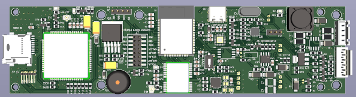
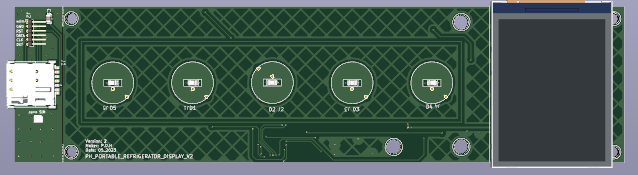

# ph_portable_refrigerator_v2_hw

Designer: Mr.Duc_Hien

## Lưu ý thiết kế Hardware.
- Khóa cửa thường hở 12V (dài x rộng x cao tối thiểu 49mm x 30mm x 20mm). -> check notOK
- Vị trí cổng USB trên tủ thay bằng khay sim. -> check OK
- Thêm led status cho simcom và PGS.
- Sử dụng các loại header cắp khác nhau để không bị cắm nhầm.
- Kiếm lại lò xo cho button.
- Thiết kế lại bus cắm LCD.
- Chú ý căn chỉnh LCD cho khớp với vỏ tủ.
- Kiếm lại IC UART - I2C chp bộ BMS.
- Thêm RS485 viết bằng software uart.

## Hồ sơ đặc tả tủ lạnh di đông.

[Mô tả tủ lạnh di động](./Mota_TuLanhDiDong.pdf)

## Block diagram.

## Hardware MCU và Display

1. **Hardware board MCU.**

    **1.1. Thông số kỹ thuật board MCU:**

    * Nguồn input 12V được lấy từ bộ pin 12V hoặc qua adapter 12V.
    * MCU : ESP32-WROOM, debug qua USB.
    * Cảm biến: nhiệt độ PT100, cảm biến cửa.
    * Lấy vị trí GPS.
    * Kết nối module SIM 3G.
    * Đọc/lưu thời gian thực qua RTC.
    * Lưu dữ liệu vào thẻ nhớ.
    * Kết nối với màn hình LCD TFT 2Inch.
    * kết nối với bàn phím cảm ứng.
    * Có RS485 (sử dụng code software serial mới dùng được).
    * Điều khiển block lạnh.
    * Điều khiển khóa tủ.
    * Điều khiển đèn chiếu sáng trong tủ.
    * Điều khiểu chuông báo.
    * Đọc dữ liệu quản lý pin từ daly BMS.
    
    **1.2. Hình ảnh bộ quản lý pin BMS**

    

    **1.3. Hình ảnh board**

    Top layer

    
    
    Bottom layer

    

    Top 3D

    

    Bottom 3D

    

2. Hardware board display.

    **2.1. Thông số kỹ thuật board display**
    * Điện áp: 3V3.
    * Giao tiếp với LCD qua giao thức SPI.
    * Giao tiếp với bàn phím cảm ứng qua giao thức I2C.
    * Có chuông báo.

    **2.2. Hình ảnh board**

    Top layer

    
    
    Bottom layer
    
    

    Top 3D

    

    Bottom 3D

    

